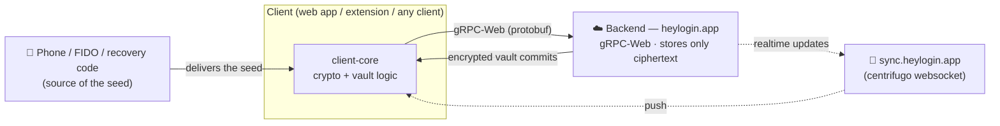
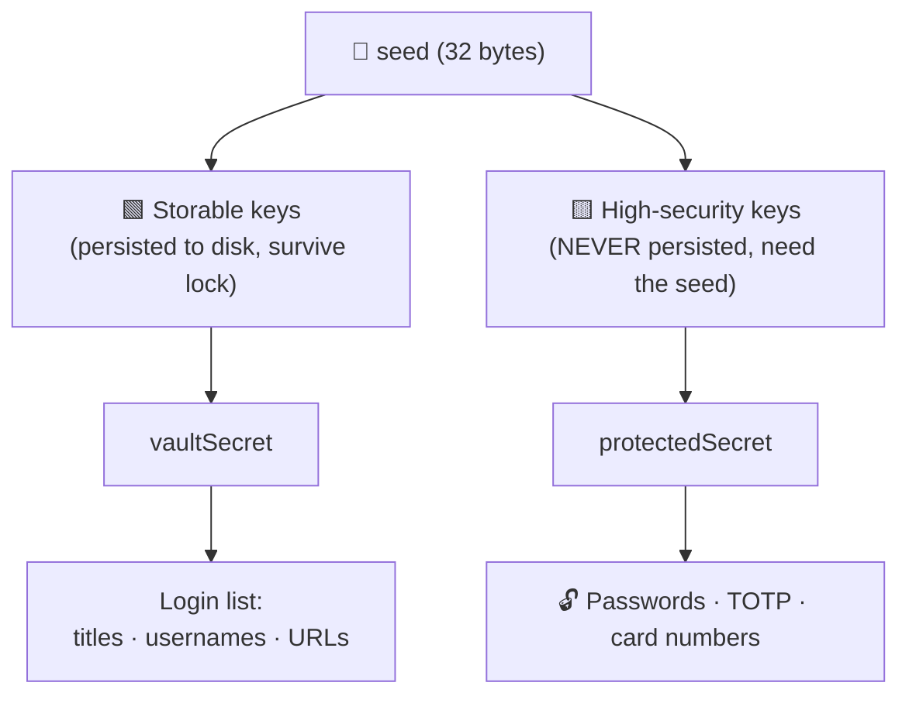
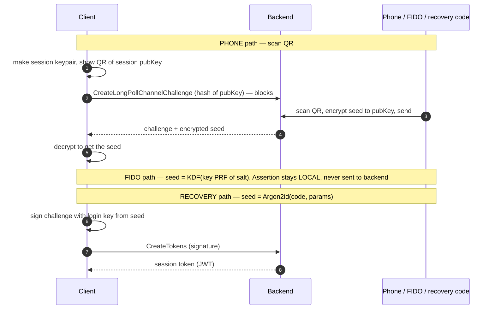
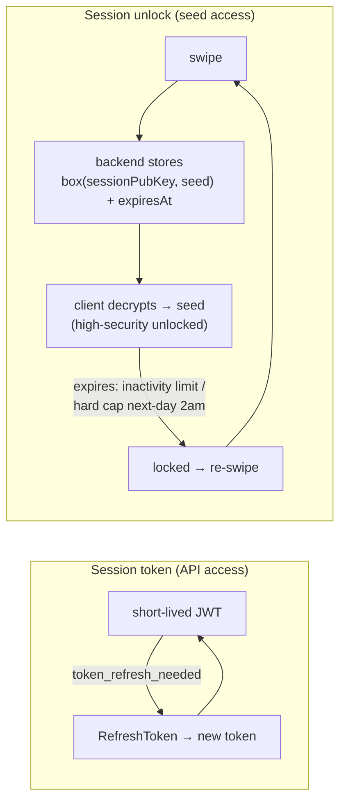

# heylogin Protocol Specification

Reverse-engineered from the Firefox extension **v1.15.813** and the web app (`heylogin.app`), both of
which ship complete original TypeScript in their `.js.map` source maps (`sourcesContent`). This document
specifies the wire protocol and cryptography of heylogin independent of any particular client.

> **Provenance & confidence.** Everything here is derived from **client** source (extension +
> web app). Message shapes, key derivations, and crypto are exact. Backend behaviour (e.g. token
> lifetime, enforcement of unlock expiry) is **inferred** from the client and is marked where relevant;
> the server (Go) is not part of these bundles. The protobuf schema is authoritative — it is embedded
> as `FileDescriptorProto`s inside the generated `*_pb.ts` files.

---

## 1. Overview

heylogin is an end-to-end encrypted password manager. The backend stores **only ciphertext** and never
sees any decryption key. Everything — login, key derivation, vault decryption — is a deterministic
function of a **32-byte `seed`**, of which there is one per *authenticator*. There is **no password**;
the seed originates from a phone, a FIDO key, or a recovery code.

Components:
- **Clients** — the web app, and thin clients (the browser extension merely opens the web app, which
  runs the whole login and hands back a session).
- **Backend** — gRPC-Web (ConnectRPC + protobuf) over HTTPS.
- **Realtime** — a centrifugo WebSocket for push/sync.



The Firefox extension does not log in itself — it opens the web app, which runs the whole login
and hands back a session. Any third-party client reimplements that web-app flow.

### Endpoints

| Purpose | URL |
|---|---|
| Backend API (gRPC-Web) | `https://heylogin.app/api/v1` |
| Realtime sync (centrifugo WS) | `https://sync.heylogin.app` |
| Audit log | `https://log.heylogin.app/api/v1` |
| HIBP range proxy | `https://data.heylogin.app/pwnedpasswords/range/` |
| Web frontend / QR origin | `https://heylogin.app` |

Transport is `@connectrpc/connect-web` `createGrpcWebTransport` (content-type
`application/grpc-web+proto`). Request metadata headers: `authorization: backend <token>`,
`client-type` (`domain.ClientType`: WEB=100, AND=200, IOS=210, EXT=300, CLI=400, …), `client-version`,
optional `client-id`, `sync-version`.

**Verified against the live backend, 2026-09-08.** gRPC-Web is not merely what the clients use —
it is the only protocol served. `application/proto` and `application/connect+proto` return
**415**; `application/grpc` returns **505**; `application/grpc-web+proto` and
`application/grpc-web+json` return 200. HTTP/1.1 is accepted, so HTTP/2 is not required.

`client-type` is **mandatory** and validated against the enum: omitted, `999` or `abc` all yield
`grpc-status: 13` with `DomainError` 10400 `BAD_REQUEST`. `CLIENT_TYPE_CLI = 400` is accepted.
`client-version` is not validated on unauthenticated methods — `0.0.0`, empty and
`not-a-version` all pass, and `CLIENT_OUTDATED` (10426) never fires; whether an authenticated
method gates on it is untested.

Errors are trailers-only: `grpc-status`, `grpc-message`, and `grpc-status-details-bin` — base64
(standard alphabet, unpadded) of a `google.rpc.Status` whose `details[0]` is an `Any` of
`domain.DomainError {code, user_title, user_detail, request_id}`. Absent credentials give
status 16 / code 30100 "Could not identify client"; rejected ones give status 7 / code 30420
"Invalid credentials". Recorded exchanges: `tests/fixtures/protocol/`.

---

## 2. Cryptographic primitives (`lib-vault-crypto`)

All primitives are libsodium-equivalent, implemented with `@noble`/`@scure`.

- **KDF** — `deriveSecretFromSeed(seed, secondary, salt, len)`:
  ```
  hs  = SHA512(seed)                 # secondary == null
      = SHA512(seed || secondary)    # else
  out = SHA512(utf8(salt) || hs)[:len]      # len ∈ {32, 64}
  ```
  A variant `deriveSecretFromSeedModern = HMAC-SHA256(key=seed[||secondary], msg=salt)` is used only
  for newer AES-GCM material.
- **Symmetric** — XSalsa20-Poly1305 secretbox (NaCl); wire = `nonce(24) || box`. Key context salt `salt-key-symmetric-`.
- **Asymmetric** — X25519 shared secret → HSalsa20 (`crypto_box_beforenm`) → XSalsa20-Poly1305; ephemeral
  sender key. Wire = `nonce(24) || ephemeralPub(32) || box` (tweetnacl `nacl.box` layout). Context salt `salt-key-encryption-`.
- **Signing** — Ed25519. `sign(key, data, salt) = Ed25519.sign(utf8(salt) || data)`. Context salt `salt-key-signing-`.
- **Hash** — SHA-512 truncated to 32 bytes.
- **Shared secret (SAS)** — X25519 → `deriveSymEncryptionKey(point, null, 'salt-shared-' + ctx)`; used
  for the mutually-authenticated push channel.
- **Recovery code** — Argon2id → 32-byte seed (§4).

The `deriveSecretFromSeedModern` variant (`HMAC-SHA256(key = seed[‖secondary], msg = utf8(salt))`,
output fixed at 32 bytes) is documented in the source as *not* a drop-in replacement — it produces
different bytes and is only for newly derived AES-GCM material.

### Context composition

Context strings come in **two layers**, and the derivation functions concatenate them. A
*key-type prefix* (`lib-vault-crypto/src/salts.ts`) selects what kind of key is being made; a
*fixedInfo* value (`client-core/src/kdfFixedInfoValues.ts`) binds it to a purpose. The KDF
receives `prefix + fixedInfo` as a single string.

```
deriveSymEncryptionKey (seed, secondary, fi)  = deriveSecretFromSeed(.., 'salt-key-symmetric-'  + fi, 32)
deriveSigningKeyPair   (seed, secondary, fi)  = deriveSecretFromSeed(.., 'salt-key-signing-'    + fi, 32) -> Ed25519 seed
deriveEncryptionKeyPair(seed, secondary, fi)  = deriveSecretFromSeed(.., 'salt-key-encryption-' + fi, 32) -> X25519 scalar
combineSharedSecret    (privK, pubK,     ctx) = deriveSymEncryptionKey(X25519(privK,pubK), null, 'salt-shared-' + ctx)
```

Signatures use their own prefixes over the *signed object's* type, not the key's:
`sign(k, obj, 'salt-sig-encryption-' + fi)` for an encryption public key,
`'salt-sig-signing-' + fi` for a signing public key, `'salt-sig-shared-' + fi` for a shared-secret
public key, and a bare `'salt-sig-hash-'` (no fixedInfo) for `signHash`.

`deriveSecretFromSeed` validates: seed exactly 32 bytes; secondary null or exactly 32; **salt at
least 8 characters**; length 32 or 64. Note the "salt-" naming is historic — the source comments
state these are NIST SP 800-56A *FixedInfo* context bindings, not cryptographic salt.

### FixedInfo values

The **secondary seed** is the authenticator's server-stored `secretSalt` (32 bytes) for every
authenticator key **except the login key**, which passes `null` — that is what lets login proceed
before `secretSalt` has been revealed. Profile keys derive from the profile seed with `null`.

| Layer | Purpose | fixedInfo |
|---|---|---|
| Authenticator | login signing (secondary = **null**) | `salt-authenticator-login-signing-key-` |
| Authenticator | identity signing, high-security | `salt-authenticator-signing-key-` |
| Authenticator | profile-seed encryption, high-security | `salt-authenticator-encryption-key-` |
| Authenticator | signing, storable | `salt-authenticator-signing-key-` |
| Authenticator | profile-seed encryption, storable | `salt-authenticator-encryption-key-` |
| Authenticator | WebAuthn seed derivation | `salt-authenticator-webauthn-seed-` |
| Profile | identity signing, high-security | `salt-profile-high-security-identity-signing-key-` |
| Profile | vault-key encryption, high-security | `salt-profile-high-security-vault-key-encryption-key-` |
| Profile | profile-key encryption, high-security | `salt-profile-high-security-profile-key-encryption-key-` |
| Profile | signing, storable | `salt-profile-storable-signing-key-` |
| Profile | vault-key encryption, storable | `salt-profile-storable-vault-key-encryption-key-` |
| Profile | profile-key encryption, storable | `salt-profile-storable-profile-key-encryption-key-` |
| Session | encryption key | `salt-session-encryption-key-` |
| Session | persistable encryption key | `salt-session-persistable-encryption-key-` |

Signature fixedInfo values (used with the `salt-sig-*` prefixes above):
`salt-authenticator-encryption-key-signature-`, `salt-authenticator-signing-key-signature-`,
`salt-profile-high-security-vault-key-encryption-key-signature-`,
`salt-profile-high-security-profile-key-encryption-key-signature-`,
`salt-profile-storable-signing-key-signature-`,
`salt-profile-storable-vault-key-encryption-key-signature-`,
`salt-profile-storable-profile-key-encryption-key-signature-`,
`salt-session-encryption-key-signature-`.

Note the high-security and storable authenticator keys share fixedInfo values
(`salt-authenticator-signing-key-` / `salt-authenticator-encryption-key-`) and are separated only
by the tier of the seed they are derived from — a detail that is easy to get wrong and produces
stable, plausible, wrong keys.

There is also `salt-profile-storable-seed-` and `salt-long-poll-login-encryption-key-`; the
latter derives the ephemeral QR-channel keypair (§5).

---

## 3. Key hierarchy

Every key is **derived** from the seed; each layer unwraps the next. The backend holds none of them.

```
                 seed (32 bytes)          per authenticator
                   │  deriveSecretFromSeed(seed, secretSalt, salt+fixedInfo)
   ┌───────────────┼───────────────┬────────────────────┐
 login           identity        profile-seed         storable
 sig key         sig key         enc key (X25519)      sig / enc keys
 (Ed25519)       (Ed25519)       high-security         (cacheable)
   │
 challenge-response → session token (bearer)
   │
 Authenticator ──► Profile ──► Vault ──► Login (password / TOTP / card)
   each layer wrapped with X25519 + XSalsa20-Poly1305 (NaCl box / secretbox)
```

### Two key tiers



- **Storable keys** are derived once and **persisted** (encrypted under the session key), so a *locked*
  client can still read non-secret content. They yield each vault's `vaultSecret`.
- **High-security keys are never persisted**; they require the seed to be present. They yield each
  vault's `protectedSecret`, which decrypts secret fields (passwords, TOTP, card numbers).

Consequently: with only storable keys a client can list logins (titles/usernames/URLs) but cannot
reveal a password — that requires the seed.

---

## 4. Authenticators

An *authenticator* is any credential registered to unlock the account. Each is defined by its own seed
and derives the identical key set (`authenticator/unsynced.ts`); they differ only in **where the seed
comes from**. Every profile carries a `ProfileAuthenticatorLock` for every authenticator (the seed
encrypted to the authenticator's profile-seed keys), so **any one authenticator unlocks all vaults**.

Server-stored per authenticator (`Authenticator`): the derived public keys, a `secretInfo` string, and a
`secretSalt` (revealed by the server only after login; mixed into all private keys except the login key).

| `AuthenticatorType` | Seed source | Interaction |
|---|---|---|
| `PUSH` (1) | phone secure element, delivered by a swipe | approve on phone |
| `BACKUP_CODE` (2) | `Argon2id(recovery code)` | type the code |
| `BACKUP_OS` (3) | OS-backed backup of the seed (iCloud/Google) | OS unlock |
| `DUMMY` (4) | seed stored **in plaintext** in `secretInfo` | none (self-unlocks) |
| `SESSION_UNLOCK` (6) | a session's time-limited unlock grant (§6) | — |
| `WEBAUTHN` (7) | FIDO2 key's PRF / `hmac-secret` output | touch + PIN/fingerprint |
| `ORGANIZATION_SERVICE` (8) | org admin-created service profile | — |

### Recovery code (`BACKUP_CODE`)
- The seed is `Argon2id(password = utf8(code), salt = b64decode(saltBase64), memory = memoryCost,
  time = iterations, parallelism, hashLen = 32)` (`src/util/recovery/calculateRecoverySeed.ts`), with
  parameters from the authenticator's `secretInfo`
  (`RecoverySecretInfo = { checksum, recoveryParameters }`, where
  `recoveryParameters = { saltBase64, iterations, memoryCost, parallelism }`).
- **The code is verifiable offline.** `checksum` is base64 of `SHA512(seed)[:32]`, so a client can
  reject a mistyped recovery code locally, before any network call
  (`authenticator/recoverySecret.ts`).
- Code format: six groups of four digits — `1234-5678-9012-3456-7890-1234` — hashed **including the dashes**.
- **Reusable**, not one-time: it is a standing authenticator, invalidated only by explicit regeneration
  (`onlineInternalRegenerateRecovery` deletes the old + adds a new one). `secretInfo` here is the checksum
  and Argon2 params (not the seed), so the code itself is still required.

### WebAuthn / FIDO (`WEBAUTHN`)
- `seed = deriveSecretFromSeed(prf, null, 'salt-authenticator-webauthn-seed-')`, where `prf` is the key's
  PRF/`hmac-secret` output for the stored `prfSalt` (`login/flow/webauthn.ts`).
- Login requests `userVerification: 'required'` → **touch + PIN/fingerprint**.
- The WebAuthn assertion uses a **locally generated** challenge and is **never sent to the backend** — the
  FIDO device is purely a local key-derivation gadget; the backend only sees the ordinary seed-signed
  login challenge.

### DUMMY
- `secretInfo = JSON.stringify({ seed })` (`authenticator/dummySecret.ts`); the seed is embedded verbatim.
- On sync, `clientCoreSync.tryUnlockingWithDummyAuth()` reads the seed out of `secretInfo` and self-unlocks
  — a permanently-unlocked, no-interaction credential.
- **Insecure by construction**: `secretInfo` is returned by `CreateChallenge` *before* login, i.e. a
  plaintext master key on the server. It is nonetheless a real, backend-supported email-pairing flow
  (`useEmailPair.tsx`: `{ dummy, push, webauthn }`), not only a test artifact. Normal UI hides it.

### SESSION_UNLOCK
An internal type representing a session that is unlocked by a **stored unlock grant** rather than a direct
swipe — the mechanism behind "stay unlocked" and "unlock this device from another device / a security
key" (§6). `accountState.getPrimaryLoginDevice()` maps it to `SECURITY_KEY`.

### ORGANIZATION_SERVICE
Both a `ProfileType` and `AuthenticatorType`: a **non-human org service account**, created by an org admin
via `OrganizationService.CreateServiceProfile(organization_id, profile, downstream_admin_profile_lock)`.
The service profile is created with **no personal authenticators** and is **locked to the admin profile**,
so it is controlled through the admin's keys. Intended for programmatic org-side automation (directory /
Entra sync, team sync, login summaries, monitoring). The independent authentication mechanism for such a
service is backend-side and not present in the client bundles.

### Lifetime & the authenticator chain
- **Authenticators never expire.** Only *session unlocks* carry an `expiresAt` (§6). An authenticator's
  seed is a standing credential until explicitly deleted or regenerated.
- Add/remove is `AuthenticatorService.Modify(create=[…], deleteAuthenticatorIds=[…],
  authenticatorBlock=<signed AuthenticatorBlock>)`. Every change is written into the **signed
  authenticator chain** (the account's `authenticator_block_hash` changes) and every authenticator is
  enumerable via `AuthenticatorService.List`. So internal/hidden types (`DUMMY`, `SESSION_UNLOCK`,
  `ORGANIZATION_SERVICE`) may not appear in a normal device list, but are visible at the protocol level.

---

## 5. Login — obtaining the seed and a session

Login is a challenge–response signed by the seed-derived login key; the three paths differ only in how the
seed is obtained. Once a seed is available:

```
loginSigPrivKey = deriveSigningKeyPair(seed, null, 'salt-authenticator-login-signing-key-')
response        = Ed25519.sign(challenge, loginSigPrivKey)
CredentialService.CreateTokens(authenticatorId, challenge, response, sessionUnlock?, sessionType)
   → { accessToken, sessionId, tokenVersion }         # bearer token (JWT)
```

`CredentialService.CreateChallenge(email? , backupAuthenticatorId?, userId?)` returns
`{ userId, challenge, authenticators[] }` (each with `id`, `authenticatorType`, `secretInfo`, and for
WebAuthn `{ webauthnId, prfSalt }`).



All three paths converge on the same final step: sign the challenge with the seed-derived login
key, then `CreateTokens`. Note the FIDO detail — the WebAuthn assertion is verified by nobody;
it is used only locally to derive the seed from the key's PRF output.

### Phone-swipe (long-poll channel)
`client-core/src/login/longPollManager.ts`:
1. Client derives a session keypair `deriveEncryptionKeyPair(random, null, 'salt-long-poll-login-encryption-key-')`
   and displays a QR = `https://heylogin.app/qr/#<base64url(pubKey)>` (`client-core/src/util/qrUris.ts`).
2. Client calls `CredentialService.CreateLongPollChannelChallenge(publicKeyHash = base64(SHA512(pubKey)[:32]))`,
   which **long-polls** until a phone approves.
3. The phone scans the QR, encrypts the authenticator seed to `pubKey`, and completes the channel; the RPC
   returns `{ userId, challenge, authenticator{id}, authenticatorReply }`.
4. `authenticatorReply` is an `AuthenticatorReply` protobuf with `encryptedSecretReply.encryptedSecret =
   asymEncrypt(pubKey, seed)`. Client decrypts with the session private key → seed → `CreateTokens`.

A richer variant (`login/flow/pushAuthenticator.ts`) adds a hash-commitment + SAS (`symKeyToSas`) for
mutual key confirmation over the channel.

### Recovery code
`seed = Argon2id(code, params)` (§4) using the `BACKUP_CODE` authenticator's params from `CreateChallenge`,
then `CreateTokens` with `sessionType = SESSION_TYPE_BACKUP_CODE`.

### WebAuthn / FIDO
`seed = KDF(key.PRF(prfSalt))` (§4), then `CreateTokens`.

### Token lifecycle
The access token is short-lived. Sync responses carry `token_refresh_needed`, and
`CredentialService.RefreshToken` issues a new access token for the same session (`tokenVersion` bumps).
With the seed a client can also re-mint a session at any time (`CreateChallenge`→`CreateTokens`). The
authenticator/seed itself does not rotate on token refresh.

---

## 6. Session unlock model ("re-swipe every hour")

A **session unlock** grants a session high-security access (the seed) for a limited time.
Two independent clocks run, and neither is a re-authentication in the human sense:



- **Token** — short-lived, rotated on its own; sync responses carry `token_refresh_needed` and
  there is a `RefreshToken` RPC. Refreshing needs no interaction.
- **Unlock** — the phone encrypts the seed to the session key; the backend stores that blob with
  an expiry and stops serving it once it lapses, so an honest client loses the seed and re-swipes.


- On a swipe, the granting party stores `encryptedSecret = asymEncrypt(sessionEncPubKey, seed)` on the
  backend with an `expiresAt`. A session reconstructs the seed by decrypting it with its session private
  key (`HighSecurityCache.fromSessionUnlock`).
- Expiry: `unlockUtils.getUnlockTime()` = **next day at 02:00** (hard cap), plus a shorter,
  activity-based limit (`SessionService.ExtendSessionUnlock(last_user_activity)`,
  `unlock_time_limit_minutes`) — the perceived ~hourly auto-lock. After expiry the backend stops serving
  the blob, so a client that discarded the seed must obtain a new unlock (re-swipe).
- **Device-to-device / security-key unlock**: a locked session publishes its signed session `encPubKey`
  and calls `SessionService.RequestSessionUnlock(source)` (broadcast via centrifugo). An already-unlocked
  session verifies that `encPubKey`'s signature against trusted authenticator keys
  (`checkEncPubKeySignature`, context `salt-session-encryption-key-signature-`), computes
  `asymEncrypt(encPubKey, seed)`, and uploads it via `SessionService.CreateSessionUnlock(sessionId,
  authenticatorId, encryptedSecret, expiresAt)`. `getPrecomputedSessionUnlocks` pre-encrypts the seed to
  every connected session's key.

### Security model (consequence)
The backend never holds any plaintext key; all decryption is client-side, so the backend **cannot enforce**
"you may decrypt now". The re-swipe/hourly limit is a **cooperative control** that assumes the client
discards the seed when its unlock expires — clients are built to persist only *storable* keys, never the
seed. A client that **retains** the seed from a single unlock therefore has **indefinite** high-security
access; combined with §4, a single high-security unlock also suffices to **enroll a new (possibly
UI-hidden) non-expiring authenticator**. Neither is cryptographically invisible — the seed's origin and any
authenticator change are recorded (authenticator chain, sync, likely audit log). Revocation is deleting the
authenticator (which rotates its seed). This is the inherent trade-off of client-side E2EE: security
depends on trusted client software forgetting the secret. *(Backend expiry enforcement is inferred; the
client architecture only makes sense if it holds.)*

---

## 7. Profiles, vaults & content

### Unlock chain
```
seed + secretSalt ──► authenticator storable/high-security profile-seed enc privkeys
ProfileAuthenticatorLock.encryptedStorableProfileSeed     ──asym-decrypt──► profile storable seed
ProfileAuthenticatorLock.encryptedHighSecurityProfileSeed ──asym-decrypt──► profile high-security seed
profile storable seed      ──KDF('salt-profile-storable-vault-key-encryption-key-')──► storableVaultKeyEncPriv
profile high-security seed ──KDF('salt-profile-high-security-vault-key-encryption-key-')──► hsVaultKeyEncPriv
VaultProfileLock.encryptedStorableVaultKey     ──asym-decrypt──► vaultSecret       (content)
VaultProfileLock.encryptedHighSecurityVaultKey ──asym-decrypt──► protectedSecret   (secret values)
```

`VaultProfileLock` carries a third, optional field not shown above:
`encryptedVaultMessagePrivateKey`, an asym-encrypted X25519 private key unwrapped with the same
`hsVaultKeyEncPriv`. It is absent for ordinary vaults.

Each lock is guarded by a **key generation**: `VaultProfileLock.lockingProfileKeyGenerationId`
must equal the unlocking profile's `keyGenerationId`, or the unlock is refused rather than
attempted. `ProfileAuthenticatorLock` is selected by matching `authenticatorId`.

`VaultService.ListCommits(vaultId, latestCommitId?, latestFirstCommitId?, forceLocks)` returns the vault's
`newer_commits[]` plus the caller's `profile_lock` / `admin_profile_lock` (a `VaultProfileLock`). Profiles
also chain to each other via `ProfileProfileLock` (a profile unlocked from an upstream profile).

### Commits & serialization
- A commit's `blob = symEncrypt(vaultSecret, serialize(state))`; `Commit.getContent(secret) =
  symDecrypt(secret, blob)`.
- `serialize.ts`: the first byte selects the format — `0x01` = Snappy-compressed (raw block, SnappyJS),
  `0x5B '['` = uncompressed JSON (automerge), `0x7B '{'` = uncompressed JSON (heymerge). Payload is
  `JSON.stringify(content)`.
- Content is a heymerge/automerge CRDT document `{ type, version, content }`. Vault types (`VaultType`):
  META, personal login, TEAM/login, groupMeta, organizationPersonal, org admin/login-summary.

### Login records & protected values
A login object contains non-secret fields (`title`, `websites`, `username`, `note`, timestamps, `history`)
and **ProtectedValues** (`password`, `customFields[].value`, TOTP): `{ encrypted }` where
`plaintext = symDecrypt(protectedSecret, encrypted)` (`ops/unprotect.ts`). History revisions carry their
own protected values.

### Meta vault & session metadata
The META vault's content holds `sessions`, `accountSettings` (incl. the protected backup code),
`siteSettings`. A device appears in the app's list only if it has a `SessionMetadata` entry here — written
by the full client during init (`onlineInitializeFromLogin` → `updateMetaSession`). A `SessionMetadata`
(heymerge list value) is `{ description, isSelfUnlocking, encPubKey, encPubKeySignature, signingAuthId,
creationTime, editTime, updateTime, isDeleted }`, where `encPubKeySignature` signs the session `encPubKey`
with the authenticator's high-security identity key (context `salt-session-encryption-key-signature-`).
Writes are new commits via `VaultService.CreateCommit(vaultId, latestCommitId, newCommitBlob, updateTime)`.

---

## 8. Protobuf services

Defined in `backend/backend-client-web/src/espb/*_service_pb.ts`; each file embeds a base64
`FileDescriptorProto` (package `domain`) recoverable into a `FileDescriptorSet`. Principal services:
`CredentialService`, `SessionService`, `SyncService` (`Sync` / `LongPollSync` / `StreamingSync`),
`VaultService`, `ProfileService`, `AuthenticatorService`, `ChannelService`, `OrganizationService`,
`ChildOrganizationService`, `WebauthnService`, `LoginInboxService`, `ShareLinkService`,
`IntegrationsService`, `AccountService`, `HealthService` (`Ping`), plus auditlog/LFD-overrides.

`SyncUpdate` carries `vaults`, `profiles`, `sessions`, `user`, `channels`, `organizations`,
`session_unlock`, `token_refresh_needed`, `sync_version`, and more.

---

## Appendix — source packages

This specification was recovered from the shipped `.js.map` source maps of two heylogin clients. File
paths cited throughout are relative to these packages:

- **Firefox extension** (v1.15.813) — packages `client-core`, `backend-client-web`, `lib-vault-crypto`,
  `client-web-sdk`, `heymerge`, `lib-form-detection`, `domain-errors`. Backend protobuf schema is embedded
  in `backend-client-web/src/espb/*_pb.ts`.
- **Web app** (`heylogin.app`) — the login state machine (`client-core/src/login/*`,
  `client-core/src/login/longPollManager.ts`), recovery-seed derivation
  (`src/util/recovery/calculateRecoverySeed.ts`), QR/pairing (`client-core/src/util/qrUris.ts`,
  `src/containers/pair/*`), and WebAuthn login (`client-core/src/login/flow/webauthn.ts`).
