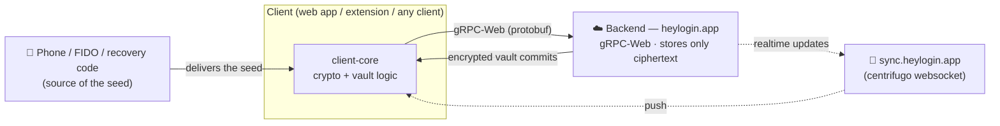
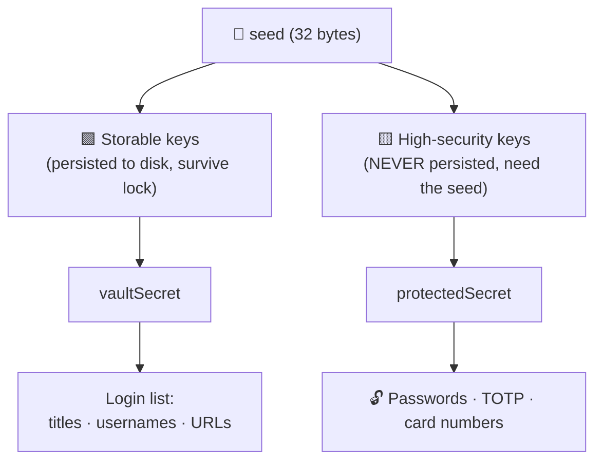
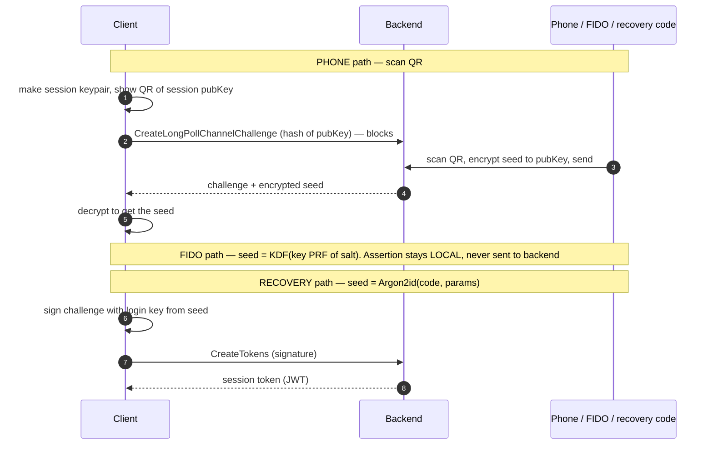
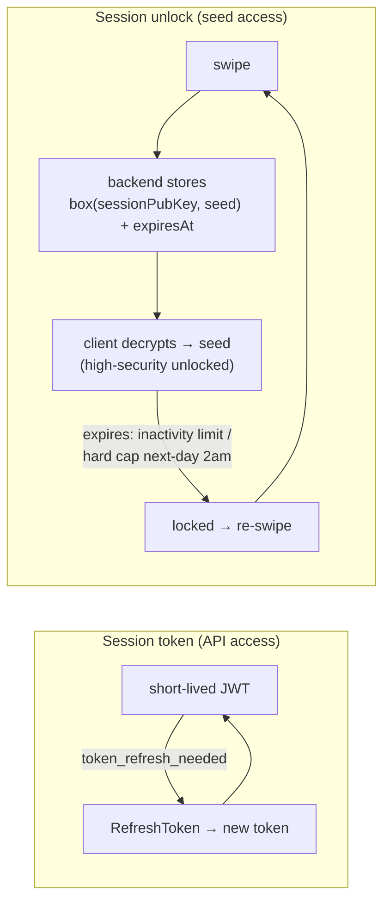

# heylogin Protocol Specification

Reverse-engineered from the Firefox extension **v1.15.813** and the web app (`heylogin.app`), both of
which ship complete original TypeScript in their `.js.map` source maps (`sourcesContent`), and
cross-checked against heylogin's own published documents. This document specifies the wire protocol
and cryptography of heylogin independent of any particular client.

> **Provenance & confidence.** Three independent sources, and they are marked throughout where they
> disagree:
>
> | source | what it settles |
> |---|---|
> | **Client source** — extension + web app `sourcesContent` | message shapes, key derivations, crypto. Exact. |
> | **Live probing** — against a real account | backend behaviour the clients cannot show: which requests are accepted, which errors come back. Marked *observed*. |
> | **heylogin Security Whitepaper v3.8** (2026-07-01) and **Compliance Whitepaper v3.0** — `https://www.heylogin.com/en/trust-center` | design intent, server-side behaviour, and the parts of the model no client reveals. Marked *whitepaper*. |
>
> Where the whitepaper and the shipped clients disagree, **the clients win** and the discrepancy is
> noted — the whitepaper is a description, the code is the protocol. The protobuf schema is
> authoritative for message shapes: it is embedded as `FileDescriptorProto`s inside the generated
> `*_pb.ts` files.

---

## 1. Overview

heylogin is an end-to-end encrypted password manager. The backend stores **only ciphertext** and never
sees any decryption key. Everything — login, key derivation, vault decryption — is a deterministic
function of a **32-byte `seed`**, of which there is one per *authenticator*. There is **no password**;
the seed originates from a phone, a FIDO key, or a recovery code.

Components:
- **Clients** — the web app, and thin clients (the browser extension merely opens the web app, which
  runs the whole login and hands back a session).
- **Backend** — gRPC-Web (ConnectRPC + protobuf) over HTTPS.
- **Realtime** — a centrifugo WebSocket for push/sync.



The Firefox extension does not log in itself — it opens the web app, which runs the whole login
and hands back a session. Any third-party client reimplements that web-app flow.

### Endpoints

| Purpose | URL |
|---|---|
| Backend API (gRPC-Web) | `https://heylogin.app/api/v1` |
| Realtime sync (centrifugo WS) | `https://sync.heylogin.app` |
| Audit log | `https://log.heylogin.app/api/v1` |
| HIBP range proxy | `https://data.heylogin.app/pwnedpasswords/range/` |
| Web frontend / QR origin | `https://heylogin.app` |

Transport is `@connectrpc/connect-web` `createGrpcWebTransport` (content-type
`application/grpc-web+proto`). Request metadata headers: `authorization: backend <token>`,
`client-type` (`domain.ClientType`: WEB=100, AND=200, IOS=210, EXT=300, CLI=400, …), `client-version`,
optional `client-id`, `sync-version`.

**Verified against the live backend, 2026-09-08.** gRPC-Web is not merely what the clients use —
it is the only protocol served. `application/proto` and `application/connect+proto` return
**415**; `application/grpc` returns **505**; `application/grpc-web+proto` and
`application/grpc-web+json` return 200. HTTP/1.1 is accepted, so HTTP/2 is not required.

`client-type` is **mandatory** and validated against the enum: omitted, `999` or `abc` all yield
`grpc-status: 13` with `DomainError` 10400 `BAD_REQUEST`. `CLIENT_TYPE_CLI = 400` is accepted.
`client-version` is not validated on unauthenticated methods — `0.0.0`, empty and
`not-a-version` all pass, and `CLIENT_OUTDATED` (10426) never fires; whether an authenticated
method gates on it is untested.

Errors are trailers-only: `grpc-status`, `grpc-message`, and `grpc-status-details-bin` — base64
(standard alphabet, unpadded) of a `google.rpc.Status` whose `details[0]` is an `Any` of
`domain.DomainError {code, user_title, user_detail, request_id}`. Absent credentials give
status 16 / code 30100 "Could not identify client"; rejected ones give status 7 / code 30420
"Invalid credentials". Recorded exchanges: `tests/fixtures/protocol/`.

---

## 2. Cryptographic primitives (`lib-vault-crypto`)

All primitives are libsodium-equivalent, implemented with `@noble`/`@scure`. *Whitepaper §3.3*
gives the same set from the vendor's side — Curve25519 (`@noble/curves`), XSalsa20-Poly1305
(`@noble/ciphers`, libsodium on mobile for autofill performance), Argon2id, and ChaCha20-Poly1305
via `age` for *server backups only*. Two points worth carrying:

* **Argon2id is used for the backup code and nowhere else.** Nothing else in heylogin is
  password-derived.
* **The seed is always 256 bits**, on every platform, chosen by heylogin rather than by the
  hardware (*whitepaper §3.4*). What differs per platform is how it is protected at rest: wrapped
  by an Android KeyStore AES key, wrapped via the iOS Keychain under a Secure Enclave AES-256-GCM
  key, or — for FIDO2 with PRF — not wrapped at all but *derived* from the key's PRF output.

- **KDF** — `deriveSecretFromSeed(seed, secondary, salt, len)`:
  ```
  hs  = SHA512(seed)                 # secondary == null
      = SHA512(seed || secondary)    # else
  out = SHA512(utf8(salt) || hs)[:len]      # len ∈ {32, 64}
  ```
  A variant `deriveSecretFromSeedModern = HMAC-SHA256(key=seed[||secondary], msg=salt)` is used only
  for newer AES-GCM material.
- **Symmetric** — XSalsa20-Poly1305 secretbox (NaCl); wire = `nonce(24) || box`. Key context salt `salt-key-symmetric-`.
- **Asymmetric** — X25519 shared secret → HSalsa20 (`crypto_box_beforenm`) → XSalsa20-Poly1305; ephemeral
  sender key. Wire = `nonce(24) || ephemeralPub(32) || box` (tweetnacl `nacl.box` layout). Context salt `salt-key-encryption-`.
- **Signing** — Ed25519. `sign(key, data, salt) = Ed25519.sign(utf8(salt) || data)`. Context salt `salt-key-signing-`.
- **Hash** — SHA-512 truncated to 32 bytes.
- **Shared secret (SAS)** — X25519 → `deriveSymEncryptionKey(point, null, 'salt-shared-' + ctx)`; used
  for the mutually-authenticated push channel.
- **Recovery code** — Argon2id → 32-byte seed (§4).

The `deriveSecretFromSeedModern` variant (`HMAC-SHA256(key = seed[‖secondary], msg = utf8(salt))`,
output fixed at 32 bytes) is documented in the source as *not* a drop-in replacement — it produces
different bytes and is only for newly derived AES-GCM material.

### Context composition

Context strings come in **two layers**, and the derivation functions concatenate them. A
*key-type prefix* (`lib-vault-crypto/src/salts.ts`) selects what kind of key is being made; a
*fixedInfo* value (`client-core/src/kdfFixedInfoValues.ts`) binds it to a purpose. The KDF
receives `prefix + fixedInfo` as a single string.

```
deriveSymEncryptionKey (seed, secondary, fi)  = deriveSecretFromSeed(.., 'salt-key-symmetric-'  + fi, 32)
deriveSigningKeyPair   (seed, secondary, fi)  = deriveSecretFromSeed(.., 'salt-key-signing-'    + fi, 32) -> Ed25519 seed
deriveEncryptionKeyPair(seed, secondary, fi)  = deriveSecretFromSeed(.., 'salt-key-encryption-' + fi, 32) -> X25519 scalar
combineSharedSecret    (privK, pubK,     ctx) = deriveSymEncryptionKey(X25519(privK,pubK), null, 'salt-shared-' + ctx)
```

Signatures use their own prefixes over the *signed object's* type, not the key's:
`sign(k, obj, 'salt-sig-encryption-' + fi)` for an encryption public key,
`'salt-sig-signing-' + fi` for a signing public key, `'salt-sig-shared-' + fi` for a shared-secret
public key, and a bare `'salt-sig-hash-'` (no fixedInfo) for `signHash`.

`deriveSecretFromSeed` validates: seed exactly 32 bytes; secondary null or exactly 32; **salt at
least 8 characters**; length 32 or 64. Note the "salt-" naming is historic — the source comments
state these are NIST SP 800-56A *FixedInfo* context bindings, not cryptographic salt.

### FixedInfo values

The **secondary seed** is the authenticator's server-stored `secretSalt` (32 bytes) for every
authenticator key **except the login key**, which passes `null` — that is what lets login proceed
before `secretSalt` has been revealed. Profile keys derive from the profile seed with `null`.

| Layer | Purpose | fixedInfo |
|---|---|---|
| Authenticator | login signing (secondary = **null**) | `salt-authenticator-login-signing-key-` |
| Authenticator | identity signing, high-security | `salt-authenticator-signing-key-` |
| Authenticator | profile-seed encryption, high-security | `salt-authenticator-encryption-key-` |
| Authenticator | signing, storable | `salt-authenticator-signing-key-` |
| Authenticator | profile-seed encryption, storable | `salt-authenticator-encryption-key-` |
| Authenticator | WebAuthn seed derivation | `salt-authenticator-webauthn-seed-` |
| Profile | identity signing, high-security | `salt-profile-high-security-identity-signing-key-` |
| Profile | vault-key encryption, high-security | `salt-profile-high-security-vault-key-encryption-key-` |
| Profile | profile-key encryption, high-security | `salt-profile-high-security-profile-key-encryption-key-` |
| Profile | signing, storable | `salt-profile-storable-signing-key-` |
| Profile | vault-key encryption, storable | `salt-profile-storable-vault-key-encryption-key-` |
| Profile | profile-key encryption, storable | `salt-profile-storable-profile-key-encryption-key-` |
| Session | encryption key | `salt-session-encryption-key-` |
| Session | persistable encryption key | `salt-session-persistable-encryption-key-` |

Signature fixedInfo values (used with the `salt-sig-*` prefixes above):
`salt-authenticator-encryption-key-signature-`, `salt-authenticator-signing-key-signature-`,
`salt-profile-high-security-vault-key-encryption-key-signature-`,
`salt-profile-high-security-profile-key-encryption-key-signature-`,
`salt-profile-storable-signing-key-signature-`,
`salt-profile-storable-vault-key-encryption-key-signature-`,
`salt-profile-storable-profile-key-encryption-key-signature-`,
`salt-session-encryption-key-signature-`.

Note the high-security and storable authenticator keys share fixedInfo values
(`salt-authenticator-signing-key-` / `salt-authenticator-encryption-key-`) and are separated only
by the tier of the seed they are derived from — a detail that is easy to get wrong and produces
stable, plausible, wrong keys.

There is also `salt-profile-storable-seed-` and `salt-long-poll-login-encryption-key-`; the
latter derives the ephemeral QR-channel keypair (§5).

---

## 3. Key hierarchy

Every key is **derived** from the seed; each layer unwraps the next. The backend holds none of them.

```
                 seed (32 bytes)          per authenticator
                   │  deriveSecretFromSeed(seed, secretSalt, salt+fixedInfo)
   ┌───────────────┼───────────────┬────────────────────┐
 login           identity        profile-seed         storable
 sig key         sig key         enc key (X25519)      sig / enc keys
 (Ed25519)       (Ed25519)       high-security         (cacheable)
   │
 challenge-response → session token (bearer)
   │
 Authenticator ──► Profile ──► Vault ──► Login (password / TOTP / card)
   each layer wrapped with X25519 + XSalsa20-Poly1305 (NaCl box / secretbox)
```

### Two key tiers



- **Storable keys** are derived once and **persisted** (encrypted under the session key), so a *locked*
  client can still read non-secret content. They yield each vault's `vaultSecret`.
- **High-security keys are never persisted**; they require the seed to be present. They yield each
  vault's `protectedSecret`, which decrypts secret fields (passwords, TOTP, card numbers).

Consequently: with only storable keys a client can list logins (titles/usernames/URLs) but cannot
reveal a password — that requires the seed.

---

## 4. Authenticators

An *authenticator* is any credential registered to unlock the account. Each is defined by its own seed
and derives the identical key set (`authenticator/unsynced.ts`); they differ only in **where the seed
comes from**. Every profile carries a `ProfileAuthenticatorLock` for every authenticator (the seed
encrypted to the authenticator's profile-seed keys), so **any one authenticator unlocks all vaults**.

Server-stored per authenticator (`Authenticator`): the derived public keys, a `secretInfo` string, and a
`secretSalt` (revealed by the server only after login; mixed into all private keys except the login key).

| `AuthenticatorType` | Seed source | Interaction |
|---|---|---|
| `PUSH` (1) | phone secure element, delivered by a swipe | approve on phone |
| `BACKUP_CODE` (2) | `Argon2id(recovery code)` | type the code |
| `BACKUP_OS` (3) | OS-backed backup of the seed (iCloud/Google) | OS unlock |
| `DUMMY` (4) | seed stored **in plaintext** in `secretInfo` | none (self-unlocks) |
| `SESSION_UNLOCK` (6) | a session's time-limited unlock grant (§6) | — |
| `WEBAUTHN` (7) | FIDO2 key's PRF / `hmac-secret` output | touch + PIN/fingerprint |
| `ORGANIZATION_SERVICE` (8) | org admin-created service profile | — |

### Recovery code (`BACKUP_CODE`)

> ⚠ **Using it is an account *recovery*, not a login.** *Whitepaper §6.5.4*: "When either the
> platform backup or backup code authenticator are used, the server side will **remove the push
> authenticator and all its locks**", and "the server side only allows for replacing the primary
> authenticator with a new one. Other operations are denied."
>
> *Observed*, under control. A phone was paired, then a single recovery run against the
> `BACKUP_CODE` authenticator:
>
> ```text
> before   CreateChallenge lists  Push a…85  +  BackupCode a…54
> run      disconnected Push a…85
> after    CreateChallenge lists  BackupCode a…54          (one authenticator)
> ```
>
> The session that recovery produced was fully usable — every derivation link and every vault
> opened through it — so the restriction the whitepaper describes ("only allows for replacing the
> primary authenticator") did not extend to reads. Recovery from here is by re-pairing the phone,
> which the whitepaper says "regenerates all profiles … replacing all Profile-Authenticator-Locks and
> all Vault-Profile-Locks", invalidating every key recorded beforehand.
>
> ⚠ **The client code does not support that last sentence.** Enrolling an authenticator regenerates
> nothing: `onlineInternalModifyAuthenticators` calls `regenerateProfiles` only when
> `deleteAuthenticatorIds` is non-empty, and the phone's own recovery path
> (`onlineRecoverWithNewAuthenticator`) deletes nothing — the server already removed the push
> authenticator. Vault regeneration is driven separately, by the backend flagging a vault `dirty` at
> sync (§7). *Observed*: in the recorded session taken straight after a real recovery, all ten vaults
> came back `dirty: false` (the `Sync` call in `crates/heyl-cli/tests/scenarios/recovery-then-doctor.json`), so the recovery itself flags
> nothing. Whether re-pairing later dirties anything is **unverified** — but no mechanism for it is
> visible in the clients.
>
> A client must therefore **not** treat this as a routine sign-in path.

- The seed is `Argon2id(password = utf8(code), salt = b64decode(saltBase64), memory = memoryCost,
  time = iterations, parallelism, hashLen = 32)` (`src/util/recovery/calculateRecoverySeed.ts`), with
  parameters from the authenticator's `secretInfo`
  (`RecoverySecretInfo = { checksum, recoveryParameters }`, where
  `recoveryParameters = { saltBase64, iterations, memoryCost, parallelism }`).
  **Always read the parameters from `secretInfo`** — the whitepaper documents 3 iterations,
  parallelism 1 and 256 MiB, but an account *observed* in the wild returned
  `memoryCost = 49152` (48 MiB), `iterations = 6`, `parallelism = 2`. Existing authenticators
  keep the parameters they were created with.
- The salt is a **256-bit** server-side value, unique per authenticator, so precomputation does not
  apply and each code must be attacked on its own (*whitepaper §6.3.4*).
- **The code is verifiable offline.** `checksum` is base64 of `SHA512(seed)[:32]`, so a client can
  reject a mistyped recovery code locally (`authenticator/recoverySecret.ts`) — but **not before
  any network call**: the checksum and the Argon2 parameters both live in `secretInfo`, which
  arrives with `CreateChallenge`. The saving is a rejected `CreateTokens` round trip, and a
  precise error instead of a backend one.
  Note the checksum is an offline *verifier for the seed*: publishing one hands an attacker an
  oracle to test candidate codes against.
- Code format: six groups of four digits — `1234-5678-9012-3456-7890-1234` — hashed **including the
  dashes**. `calculateRecoverySeed` performs **no normalisation at all**; it hashes the string as
  given, so only the canonical spelling works. 24 digits ≈ **79.7 bits** of entropy; digits were
  chosen over words or hex because they are unambiguous to transcribe by hand and fastest on a
  numeric soft keyboard (*whitepaper §6.3.4*).
- **Argon2id is used here and nowhere else** in heylogin (*whitepaper §3.3*).
- **Reusable**, in that the code itself is a standing credential invalidated only by explicit
  regeneration (`onlineInternalRegenerateRecovery` deletes the old + adds a new one) — but see the
  warning above: each *use* tears down the push authenticator, so it is not repeatable without
  re-pairing in between. `secretInfo` here is the checksum and Argon2 params (not the seed), so the
  code itself is still required.
- *Observed*: **`CreateTokens` from a `BACKUP_CODE` authenticator is refused for browser-family
  client types.** `CLIENT_TYPE_CLI` (400), `CLIENT_TYPE_WEB` (100) and `CLIENT_TYPE_EXT` (300) all
  return `grpc-status 3` with `DomainError 30460 INVALID_SESSION_TYPE`, for **every** value of
  `session_type` including the proto3 zero; `CLIENT_TYPE_AND` (200) and `CLIENT_TYPE_IOS` (210) are
  accepted. Consistently, no shipped surface exposes recovery login: `LoginManager.initiateLogin`
  returns `{ push, dummy, webauthn }`, and `initiateLoginForRecovery` is called from exactly one
  place in either bundle — heylogin's internal debug harness, on `ClientType.TEST`.

### WebAuthn / FIDO (`WEBAUTHN`)
- `seed = deriveSecretFromSeed(prf, null, 'salt-authenticator-webauthn-seed-')`, where `prf` is the key's
  PRF/`hmac-secret` output for the stored `prfSalt` (`login/flow/webauthn.ts`). *Whitepaper §3.4*
  describes the same thing from the other side: "heylogin sends a salt to the security key, which
  returns a PRF result, and the 256 bit seed is derived from that result".
- Without PRF support, a FIDO2 device is **not** a standalone authenticator: it is paired as a
  signature-only device, and the server releases the *mobile* authenticator's encrypted seed once
  the assertion verifies (*whitepaper §6.3.2*). With PRF it can be "upgraded" to a real
  `WEBAUTHN` authenticator. Platform authenticators (Windows Hello, Touch ID) bind to the **session**
  that paired them, not to the user.
- Login requests `userVerification: 'required'` → **touch + PIN/fingerprint**.
- The WebAuthn assertion uses a **locally generated** challenge and is **never sent to the backend** — the
  FIDO device is purely a local key-derivation gadget; the backend only sees the ordinary seed-signed
  login challenge.

### DUMMY
- `secretInfo = JSON.stringify({ seed })` (`authenticator/dummySecret.ts`); the seed is embedded verbatim.
- On sync, `clientCoreSync.tryUnlockingWithDummyAuth()` reads the seed out of `secretInfo` and self-unlocks
  — a permanently-unlocked, no-interaction credential.
- **Insecure by construction**: `secretInfo` is returned by `CreateChallenge` *before* login, i.e. a
  plaintext master key on the server. It is nonetheless a real, backend-supported email-pairing flow
  (`useEmailPair.tsx`: `{ dummy, push, webauthn }`), not only a test artifact. Normal UI hides it.

### SESSION_UNLOCK
A session that is unlocked by a **stored unlock grant** rather than a direct swipe — the mechanism
behind "stay unlocked" and "unlock this device from another device / a security key" (§6).
`accountState.getPrimaryLoginDevice()` maps it to `SECURITY_KEY`.

*Whitepaper §6.5.3* gives it a concrete purpose: it is what an **organisation user with no
smartphone** gets. A FIDO2-only user is onboarded with a `SESSION_UNLOCK` authenticator as their
*only* authenticator, and the encrypted authenticator seed "will never be deleted on the server even
if the session is locked, as it cannot be recovered". That has two consequences worth knowing: such
an account is limited to a single session, and losing that session (clearing browser storage) locks
the user out entirely — only an organisation admin can recover them.

### Organisation onboarding (context for `ORGANIZATION_SERVICE` and free profiles)
*Whitepaper §6.5.2.* An admin creates an organisation profile for a new member in a **free** state —
no key material, and empty `VaultProfileLock`s that merely record intended membership. The member
claims it with a **start code**: six characters as a two-character prefix and four-character suffix,
`HL-A1B2`. Three wrong attempts block the code until an admin regenerates it, which is what lets it
be so short. Claiming creates the profile seeds and `ProfileAuthenticatorLock`s; the admin then
replaces the empty locks with real ones, needing only the profile's public keys.

### ORGANIZATION_SERVICE
Both a `ProfileType` and `AuthenticatorType`: a **non-human org service account**, created by an org admin
via `OrganizationService.CreateServiceProfile(organization_id, profile, downstream_admin_profile_lock)`.
The service profile is created with **no personal authenticators** and is **locked to the admin profile**,
so it is controlled through the admin's keys. Intended for programmatic org-side automation (directory /
Entra sync, team sync, login summaries, monitoring). The independent authentication mechanism for such a
service is backend-side and not present in the client bundles.

### Lifetime & the authenticator chain
- **Authenticators never expire.** Only *session unlocks* carry an `expiresAt` (§6). An authenticator's
  seed is a standing credential until explicitly deleted or regenerated.
- Add/remove is `AuthenticatorService.Modify(create=[…], deleteAuthenticatorIds=[…],
  authenticatorBlock=<signed AuthenticatorBlock>)`. Every change is written into the **signed
  authenticator chain** (the account's `authenticator_block_hash` changes) and every authenticator is
  enumerable via `AuthenticatorService.List`. So internal/hidden types (`DUMMY`, `SESSION_UNLOCK`,
  `ORGANIZATION_SERVICE`) may not appear in a normal device list, but are visible at the protocol level.

### Enrolment — how an authenticator is created

> **An authenticator is created by whoever holds its seed.** There is no protocol by which one client
> enrols a *remote* device: every published field is derived from the seed
> (`authenticator/unsynced.ts`), so the party that performs the write knows the new seed. A client
> that wants to add a phone cannot; the phone adds itself. This is the single most consequential fact
> in this section — see §5's note on which way the pairing QR points.

`UnsyncedAuthenticator.createWithSalt(type, secretInfo, { seed }, secretSalt)`, with
`secretSalt = randomSeed()` (32 bytes) and `secretInfo = ''` for `PUSH`, derives:

| field | derivation |
|---|---|
| `highSecurityLoginSigPubKey` | `deriveSigningKeyPair(seed, **null**, 'salt-authenticator-login-signing-key-')` |
| `storableSigPubKey` | `deriveSigningKeyPair(seed, secretSalt, 'salt-authenticator-signing-key-')` |
| `storableProfileSeedEncPubKey` | `deriveEncryptionKeyPair(seed, secretSalt, 'salt-authenticator-encryption-key-')` |
| `highSecurityIdentitySigPubKey` | `deriveSigningKeyPair(seed, secretSalt, 'salt-authenticator-signing-key-')` |
| `highSecurityProfileSeedEncPubKey` | `deriveEncryptionKeyPair(seed, secretSalt, 'salt-authenticator-encryption-key-')` |

The high-security and storable constants hold the same fixedInfo values (§2), so the two tiers coincide
at this layer; the DTO carries both names for one key pair each. Three signatures accompany them, all
made with `highSecurityIdentitySigPrivKey`:
`highSecurityProfileSeedEncPubKeySignature`, `storableProfileSeedEncPubKeySignature` (both
`salt-sig-encryption-` + the `-signature-` fixedInfo) and `storableSigPubKeySignature`
(`salt-sig-signing-` + …).

`serializeAuthenticator` sends `id = nullUuid` for a creation; the server assigns the real id and
returns it in `ModifyAuthenticatorsResponse.authenticator_ids`.

**Per-profile locks.** `serializeForCreation` builds one `ProfileAuthenticatorLock` per profile — for
every profile in the repo **and every disabled profile** — as
`{ encryptedHighSecurityProfileSeed: asymEncrypt(newAuth.highSecurityProfileSeedEncPubKey, hsSeed),
encryptedStorableProfileSeed: asymEncrypt(newAuth.storableProfileSeedEncPubKey, storableSeed) }`,
with `authenticatorId = nullUuid`. Producing them requires the writer to unlock every profile, so
enrolment is a **high-security** operation: it needs the seed, not merely a session.

**The block.** `AuthenticatorBlock.create(privKey, keys, parent)` (`client-core/src/authenticatorBlock.ts`):

```text
content    = { parent: base64(parentHash ?? hashData(utf8('INITIAL_AUTHENTICATOR_BLOCK'))),
               keys:   [base64(serializedSigPubKey), …].sort() }        # JS default string sort
blob       = utf8(JCS(content))                       # RFC 8785, `json-canonicalize`
hash       = hashData(blob)                           # SHA512(blob)[:32]
signature  = sign(highSecurityIdentitySigPrivKey, hash, 'salt-sig-hash-')
```

`keys` is **every** authenticator's `highSecurityIdentitySigPubKey` after the change (survivors plus
new), `parent` is the account's current `authenticator_block_hash`, and the signature is made by an
authenticator present in the *previous* block — which is what `verify()` checks on the reading side.
`salt-sig-hash-` carries no fixedInfo suffix; it is the whole context.

**The write.** `AuthenticatorService.Modify(create_authenticator_ops = [{ data, profileLocks, webauthn? }],
delete_authenticator_ids, authenticator_block = blob, authenticator_block_signature = signature,
profiles = regeneratedProfiles)`, wrapped by `performWithSyncSuperUsersAndAllProfiles` — a sync with
`syncSuperUsers = true` and all profiles enabled, before and after.

**Deleting is what regenerates.** `onlineInternalModifyAuthenticators` calls `regenerateProfiles` only
when `deleteAuthenticatorIds` is non-empty; a pure addition sends `profiles = []` and leaves every
profile seed, `ProfileAuthenticatorLock` and `VaultProfileLock` untouched. The "re-pairing regenerates
everything" behaviour of §7 therefore belongs to *removal*, not to enrolment. A client may not delete
the authenticator it is currently using (`RemoveLocalAuthenticatorError`).

### Recovery, and the replacement it exists for

`ClientCore.onlineRecoverWithNewAuthenticator(params, backend, unsyncedAuth, hsc, platform, extra = [])`
is the whole of what the whitepaper means by "the server side only allows for replacing the primary
authenticator":

1. recovery-code login (`LoginFlowRecovery`, `SessionType.BACKUP_CODE`) — §5;
2. `Sync`;
3. `onlineAddAuthenticators([newAuth, …extra])` — the **caller** generates the new seed with
   `randomSeed()`; the enrolment above runs with no deletions, so nothing is regenerated;
4. `onlineLogoutSession(currentSessionId)` — the recovery session is **discarded immediately**;
5. `CreateChallenge(userId)` then `finishChallengeSelfUnlocking` as the *new* authenticator, with
   `SESSION_TYPE_SELF_UNLOCKING_PRIMARY` and **no** `session_unlock`.

`onlineAddAuthenticators` has exactly one caller in the shipped code, and it is this. The web app has
**no recovery UI at all** — the only place it appears is the debug harness `VirtualPushAuthenticator`,
which mirrors the phone: recover, mint a fresh `PUSH` seed, enrol it, continue as that authenticator.
So the product's recovery is a **phone** flow, and the phone recovers *itself*.

---

## 5. Login — obtaining the seed and a session

Login is a challenge–response signed by the seed-derived login key; the three paths differ only in how the
seed is obtained. Once a seed is available:

```
loginSigPrivKey = deriveSigningKeyPair(seed, null, 'salt-authenticator-login-signing-key-')
response        = Ed25519.sign(utf8(challenge), loginSigPrivKey)     # unprefixed
CredentialService.CreateTokens(authenticatorId, challenge, response, sessionUnlock?, sessionType)
   → { accessToken, sessionId, tokenVersion }         # bearer token (JWT)
```

**What exactly is signed.** `finishChallenge.ts` calls `signString(loginSigPrivKey, challenge, null)`,
and `signString(key, data, salt) = sign(key, decodeUTF8(data), salt)` with
`sign(…, salt = null) = ed25519.sign(data)`. So the signed message is the challenge's **UTF-8 bytes,
with no context prefix** — the one signing operation in heylogin that is not context-prefixed (§2).
*Observed*: confirmed against the backend — corrupting one bit of the signature draws
`DomainError 30400 INVALID_SIGNATURE`, while the correct signature is accepted.

**The challenge is a JWT**, not an opaque blob or base64: roughly 212 characters of
`{"iss":"challenge","sub":"<userId>","exp":<unix>}`. It is signed as the *string*, dots and all —
which is also why any attempt to base64-decode it first fails outright.

**`sessionType` is a property of the client, not of the authentication method** — it is a
`LoginManager` constructor argument (`login/manager.ts`). What the shipped clients send:

| flow | sessionType |
|---|---|
| web app, fresh login (`useEmailPair`, `useQrPair`) | `SESSION_TYPE_CONNECTED` |
| re-login with a stored authenticator (`clientCore.ts`) | `SESSION_TYPE_SELF_UNLOCKING_PRIMARY` |
| recovery, in heylogin's debug harness on `ClientType.TEST` | `SESSION_TYPE_BACKUP_CODE` |

*Observed*: `session_type` is **not** what the backend validates first. `DomainError 30460
"invalid session type"` is raised on the **authenticator**: a `BACKUP_CODE` authenticator is refused
for every session type from a browser-family client, while naming a different authenticator id in the
identical request changes the error to `authenticator not found`. See §4.

`CredentialService.CreateChallenge(email? , backupAuthenticatorId?, userId?)` returns
`{ userId, challenge, authenticators[] }` (each with `id`, `authenticatorType`, `secretInfo`, and for
WebAuthn `{ webauthnId, prfSalt }`).



All three paths converge on the same final step: sign the challenge with the seed-derived login
key, then `CreateTokens`. Note the FIDO detail — the WebAuthn assertion is verified by nobody;
it is used only locally to derive the seed from the key's PRF output.

### Phone-swipe (long-poll channel)
`client-core/src/login/longPollManager.ts`:
1. Client derives a session keypair `deriveEncryptionKeyPair(random, null, 'salt-long-poll-login-encryption-key-')`
   and displays a QR = `https://heylogin.app/qr/#<base64url(pubKey)>` (`client-core/src/util/qrUris.ts`).
2. Client calls `CredentialService.CreateLongPollChannelChallenge(publicKeyHash = base64(SHA512(pubKey)[:32]))`,
   which **long-polls** until a phone approves. (*Whitepaper §6.4.2* calls this hash "SHA256"; both
   are 32 bytes, and `hashData` — `SHA512(·)[:32]` — is what the clients compute and what the
   backend accepts. *Observed*: a channel opened with the SHA512-truncated hash completes normally.)
3. The phone scans the QR, encrypts the authenticator seed to `pubKey`, and completes the channel; the RPC
   returns `{ userId, challenge, authenticator{id}, authenticatorReply }`.
4. `authenticatorReply` is an `AuthenticatorReply` protobuf with `encryptedSecretReply.encryptedSecret =
   asymEncrypt(pubKey, seed)`. Client decrypts with the session private key → seed → `CreateTokens`.

**Scanning is never sufficient.** The app always requires an explicit confirmation that the scanned
device should be paired, and it ignores a QR URL invoked through its own URL handler, forcing a real
scan (*whitepaper §5.7*). heylogin is explicit that this leaves QR pairing exposed to phishing and
Browser-in-the-Middle relaying, and points organisations with elevated requirements at FIDO2 instead.

**Which way the QR points.** The QR carries the *scanning client's* public key, and the reply carries
the **phone's existing seed** to that client. It creates a **session for the scanner**; it never
creates an authenticator, and there is no message in either direction that would enrol the phone (§4).
On the phone side the whole of it is
`onlineLongPollChannelSendSecret(pubKeyB64, ownSeed, registration)` →
`CompleteLongPollChannel(publicKeyHash = base64(hashData(serializedPubKey)), authenticatorId, authReply)`.

`AuthenticatorReply.encryptedSecretReply` carries a second field, `registration`, and it means only
"this seed comes from a device registering the account, not from a login": the receiving client sets
`createUnlock = !registration`, so a registration flow skips the self-granted session unlock
(`longPollManager.ts`). It does not signal enrolment of any kind.

**The QR URI grammar** (`client-core/src/util/qrUris.ts`) has two forms, distinguished by path:

| form | URI | hash payload |
|---|---|---|
| `pair` | `<origin>/qr/` — note the **trailing slash**, kept "for historical reasons" | `base64url(longPollPubKey)` |
| `join` | `<origin>/qr/join/<profileId>` | `base64url(profileHighSecuritySeed)` |

`parseQrUri` distinguishes them by exactly that trailing empty segment, so a `pair` URI without it does
not parse. `origin` is whatever client renders the code (`window.location.origin` in the web app).

A variant (`login/flow/pushAuthenticator.ts`) adds a hash-commitment + SAS (`symKeyToSas`) for mutual
key confirmation over the channel. *Compliance whitepaper §4.4* gives it a purpose rather than
treating it as an enrichment: it is the path **"for devices without a camera"** — which is what any
headless or terminal client is. A client that cannot scan should expect to implement the SAS variant,
not the QR one.

It runs over the **generic `ChannelService`**, not the long-poll RPC: `Create(userId, data, type,
exposed)` opens a channel whose body is a typed `channel_messages` protobuf, and `Claim` / `Read` /
`Write` move messages between the two `ChannelRecipient`s, `CLIENT` and `AUTHENTICATOR`
(`backend-client-web/src/channels.ts`). For a login channel:

1. client → `Create(userId, LoginHashCommitmentBody{ hashCommitment }, 'login', exposed = true)`,
   the commitment being `hashData` of its own shared-secret public key;
2. authenticator → `Claim(channelId, authenticatorId, LoginAuthenticatorPubKeyBody{ … })`, which
   returns the commitment;
3. client → `Write(AUTHENTICATOR, LoginClientPubKeyBody{ clientPubKey })`, opening the commitment;
   the authenticator verifies it against the hash it already holds (`InvalidHashCommitmentError`);
4. both sides `combineSharedSecret(priv, pub, 'push-login')` and display `symKeyToSas(sharedSecret)`
   for the human to compare;
5. authenticator → `Write(CLIENT, LoginEncryptedSecretBody{ encryptedSecret = symEncrypt(shared, seed),
   authenticatorId })`; `Delete(channelId)` closes it.

The seed still arrives from the phone, so the SAS variant changes how the channel is authenticated,
not what it transports.

### Recovery code
`seed = Argon2id(code, params)` (§4) using the `BACKUP_CODE` authenticator's params from `CreateChallenge`,
then `CreateTokens` with `sessionType = SESSION_TYPE_BACKUP_CODE`.

**This is a recovery, not a login** — it deletes the push authenticator, and it is refused to
browser-family client types. See the warning in §4 before using it for anything.

### WebAuthn / FIDO
`seed = KDF(key.PRF(prfSalt))` (§4), then `CreateTokens`.

### Token lifecycle
The access token is short-lived. Sync responses carry `token_refresh_needed`, and
`CredentialService.RefreshToken` issues a new access token for the same session (`tokenVersion` bumps).
With the seed a client can also re-mint a session at any time (`CreateChallenge`→`CreateTokens`). The
authenticator/seed itself does not rotate on token refresh.

---

## 6. Session unlock model ("re-swipe every hour")

A **session unlock** grants a session high-security access (the seed) for a limited time.
Two independent clocks run, and neither is a re-authentication in the human sense:



- **Token** — short-lived, rotated on its own; sync responses carry `token_refresh_needed` and
  there is a `RefreshToken` RPC. Refreshing needs no interaction.
- **Unlock** — the phone encrypts the seed to the session key; the backend stores that blob with
  an expiry and stops serving it once it lapses, so an honest client loses the seed and re-swipes.


- On a swipe, the granting party stores `encryptedSecret = asymEncrypt(sessionEncPubKey, seed)` on the
  backend with an `expiresAt`. A session reconstructs the seed by decrypting it with its session private
  key (`HighSecurityCache.fromSessionUnlock`).
- **A session must publish a *signed* encryption key before anyone will unlock it.** `SessionKeys`
  signs the session `encPubKey` with the authenticator's `highSecurityIdentitySigPrivKey` under
  `salt-sig-encryption-` + `salt-session-encryption-key-signature-`, and publishes key and signature
  as `SessionMetadata` in the META vault (§7). Before granting, the phone runs
  `checkEncPubKeySignature(accountState.authenticators.map(a => a.storableSigPubKey), encPubKey,
  signature, …)` and refuses with `NoMatchingSigningKeyFoundError` if none matches — note it verifies
  against `storableSigPubKey` a signature made with the *identity* key, which works only because the
  two fixedInfo constants coincide (§2), and is independent evidence that they do.
  **Consequence for a third-party client**: a session that never writes `SessionMetadata` can only
  ever self-grant its unlock at `CreateTokens` time. No phone can unlock it later, because there is
  nothing for the phone to verify or encrypt to.
- A login self-grant is not a third-party liberty: `finishChallenge` sends
  `sessionUnlock = { encryptedSecret: asymEncrypt(ownSessionEncPubKey, seed), expiresAt:
  getUnlockTime(), singleUse: false }` on every seed-bearing login, and omits it only when the reply
  carried `registration = true` (§5).
- Expiry, three independent limits:
  1. `unlockUtils.getUnlockTime()`, the value the *client requests*, is
     ```js
     const date = new Date(new Date().getTime() + 86_400_000);  // tomorrow
     date.setHours(2, 0, 0, 0);                                 // at 2am
     ```
     — **always tomorrow at 02:00 local**, never today's. Run at 01:00 it returns a deadline 25
     hours away, not one hour away; `setHours` is local, and the offset is an absolute
     86,400,000 ms rather than a calendar day (they differ across a DST transition). "The next
     02:00" is the natural reading of that code and it is wrong.
  2. A shorter, activity-based limit (`SessionService.ExtendSessionUnlock(last_user_activity)`,
     `unlock_time_limit_minutes`) — the perceived ~hourly auto-lock.
  3. *Whitepaper §6.4.3*: the server "automatically deletes" the encrypted seed **after 30 hours**,
     regardless of what the client asked for.

  After expiry the backend stops serving the blob, so a client that discarded the seed must obtain a
  new unlock (re-swipe).
- The session keypair the blob is encrypted to is **KDF-derived, not raw randomness**:
  `createUnsignedSessionKeys()` is
  `deriveEncryptionKeyPair(randomSeed(), null, FIXED_INFO_SESSION_ENCRYPTION_KEY)`. Using the random
  bytes directly as an X25519 scalar round-trips perfectly against itself and is wrong against
  everyone else — it diverges only where the public half is published and signed.
- *Whitepaper §6.4.3*: locked/unlocked is an **implicit state** — "the presence of an encrypted
  authenticator seed inside a session means that the session is unlocked". There is no separate flag.
- **Device-to-device / security-key unlock**: a locked session publishes its signed session `encPubKey`
  and calls `SessionService.RequestSessionUnlock(source)` (broadcast via centrifugo). An already-unlocked
  session verifies that `encPubKey`'s signature against trusted authenticator keys
  (`checkEncPubKeySignature`, context `salt-session-encryption-key-signature-`), computes
  `asymEncrypt(encPubKey, seed)`, and uploads it via `SessionService.CreateSessionUnlock(sessionId,
  authenticatorId, encryptedSecret, expiresAt)`. `getPrecomputedSessionUnlocks` pre-encrypts the seed to
  every connected session's key.

### Security model (consequence)
The backend never holds any plaintext key; all decryption is client-side, so the backend **cannot enforce**
"you may decrypt now" *within* an unlock window. It can, and does, stop serving the blob: the
whitepaper's 30-hour server-side deletion means expiry enforcement is **documented rather than
inferred**. Within the window, the re-swipe/hourly limit is a **cooperative control** that assumes the
client discards the seed when its unlock expires — clients are built to persist only *storable* keys, never the
seed. A client that **retains** the seed from a single unlock therefore has **indefinite** high-security
access; combined with §4, a single high-security unlock also suffices to **enroll a new (possibly
UI-hidden) non-expiring authenticator**. Neither is cryptographically invisible — the seed's origin and any
authenticator change are recorded (authenticator chain, sync, likely audit log). Revocation is deleting the
authenticator (which rotates its seed). This is the inherent trade-off of client-side E2EE: security
depends on trusted client software forgetting the secret. *(Backend expiry enforcement is inferred; the
client architecture only makes sense if it holds — and *whitepaper §6.4.3* confirms it.)*

**A locked session is not keyless.** *Whitepaper §6.4.3*: an unlocked session may persist any
*storable* key pair — in practice `profileSeedEnc_s`, `vaultKeyEnc_s` and `sig_s` — which lets a
locked client decrypt `vaultKey_s` and read titles, usernames and websites, but not passwords, TOTP
secrets or protected custom fields. This is what the extension's on-page overlay uses. A client may
of course decline to persist them, at the cost of needing an unlock for every read.

---

## 7. Profiles, vaults & content

### Unlock chain
```
seed + secretSalt ──► authenticator storable/high-security profile-seed enc privkeys
ProfileAuthenticatorLock.encryptedStorableProfileSeed     ──asym-decrypt──► profile storable seed
ProfileAuthenticatorLock.encryptedHighSecurityProfileSeed ──asym-decrypt──► profile high-security seed
profile storable seed      ──KDF('salt-profile-storable-vault-key-encryption-key-')──► storableVaultKeyEncPriv
profile high-security seed ──KDF('salt-profile-high-security-vault-key-encryption-key-')──► hsVaultKeyEncPriv
VaultProfileLock.encryptedStorableVaultKey     ──asym-decrypt──► vaultSecret       (content)
VaultProfileLock.encryptedHighSecurityVaultKey ──asym-decrypt──► protectedSecret   (secret values)
```

`VaultProfileLock` carries a third, optional field not shown above:
`encryptedVaultMessagePrivateKey`, an asym-encrypted X25519 private key unwrapped with the same
`hsVaultKeyEncPriv`. It is absent for ordinary vaults.

Each lock is guarded by a **key generation**: `VaultProfileLock.lockingProfileKeyGenerationId`
must equal the unlocking profile's `keyGenerationId`, or the unlock is refused rather than
attempted. `ProfileAuthenticatorLock` is selected by matching `authenticatorId`.

*Observed*: `ProfileAuthenticatorLock` also carries `profile_id` and `profile_key_generation_id`,
but the backend leaves **both empty** when the lock is nested inside the `SyncUpdateProfile` that
already identifies it — which is every lock on the login path. A client must inherit them from the
enclosing profile rather than require them, while still rejecting a *stated* value that disagrees.

**Which profiles exist** (*whitepaper §6.3.5*). The mobile app creates two on setup, and more appear
with organisations:

| profile | purpose |
|---|---|
| Inbox | the user's "public address" — what others encrypt to when sending them something |
| Preferences | metadata: session names, and the optional backup code so it can be shown again on another device |
| Private | optional; the Private Vault of personal logins (the free personal tier) |
| Organization | one per member, represents membership and reaches the org's teams |
| Organization Admin | the cryptographic administrator; reached from a member profile via `ProfileProfileLock` |

Note the consequence of the Preferences profile: **the backup code is itself stored in a vault**, so
anyone who can decrypt that vault can read it.

`VaultService.ListCommits(vaultId, latestCommitId?, latestFirstCommitId?, forceLocks)` returns the vault's
`newer_commits[]` plus the caller's `profile_lock` / `admin_profile_lock` (a `VaultProfileLock`). Profiles
also chain to each other via `ProfileProfileLock` (a profile unlocked from an upstream profile).

### Commits & serialization
- A commit's `blob = symEncrypt(vaultSecret, serialize(delta))`; `Commit.getContent(secret) =
  symDecrypt(secret, blob)`. The `delta` holds only the elements that commit changed — **not**
  the whole vault — so a single blob is not the current state; see the fold in the next point.
  *(Measured: a login vault's fourth commit held one login, not the four that existed.)*
- *Whitepaper §6.4.1*: commits are **not cryptographically linked**. They are ordered by their
  server-side creation time, and applying them in order yields the current state. There is no hash
  chain to verify.
- **Key rotation ("regeneration")**, *whitepaper §6.6.1*: a vault is flagged `dirty` when someone
  who had access should no longer have it. On the next commit the client squashes every commit into
  a single new one under a fresh `vaultKeyₛ`/`vaultKey_hs`, starts a new **generation**, writes new
  `VaultProfileLock`s and discards the old commits and locks. Profiles regenerate the same way
  (new profile seeds, all locks replaced). The client acts on `dirty` during sync
  (`onlineInternalSync`: dirty private and personal vaults are always regenerated, and a dirty vault
  refuses queued vault messages), and regenerates *profiles* only when a client deletes an
  authenticator (§4). The whitepaper's "recovery invalidates every previously observed key" is a
  statement about the server flagging state, and it did not hold for the recovery we recorded — see
  the warning in §4.

> **Measured, on a live account.** Regenerating the recovery code in the heylogin app *does* take the
> client deletion path, and it rotates both layers at once. Before and after one regeneration,
> nothing else touched:
>
> | | before → after |
> |---|---|
> | the four profiles | every `keyGenerationId` **changed** |
> | three of five vaults | `generationId` **changed** — squashed under a fresh vault key |
> | the other two vaults | `dirty: false` → **`true`**, awaiting the next commit by a client with access |
> | authenticators | the `BACKUP_CODE` id was **deleted and a new one added**; `PUSH` and `BACKUP_OS` untouched |
>
> So `onlineInternalRegenerateRecovery`'s delete+add is a non-empty `deleteAuthenticatorIds`,
> `regenerateProfiles` runs, and vault rotation follows from the `dirty` flag exactly as §7 describes.
>
> The two findings compose into the only reliable way to retire key material that has been observed:
> **a recovery removes an authenticator but rotates nothing; regenerating the recovery code rotates
> everything but leaves surviving authenticators able to unlock the new material.** Retiring a
> published seed needs both — the authenticator deleted *and* the keys rotated afterwards. That is
> what `tools/README.md`'s recording ritual is, and why neither half of it is optional.
- `serialize.ts`: the first byte selects the format — `0x01` = Snappy-compressed (raw block, SnappyJS),
  `0x5B '['` = uncompressed JSON (automerge), `0x7B '{'` = uncompressed JSON (heymerge). Payload is
  `JSON.stringify(content)`.
- Content is a heymerge/automerge CRDT document `{ type, version, content }`. Vault types (`VaultType`):
  META, personal login, TEAM/login, groupMeta, organizationPersonal, org admin/login-summary.

### Login records & protected values
A login object contains non-secret fields (`title`, `websites`, `username`, `note`, timestamps, `history`)
and **ProtectedValues** (`password`, `customFields[].value`, TOTP): `{ encrypted }` where
`plaintext = symDecrypt(protectedSecret, encrypted)` (`ops/unprotect.ts`). History revisions carry their
own protected values.

### Meta vault & session metadata
The META vault's content holds `sessions`, `accountSettings` (incl. the protected backup code),
`siteSettings`. A device appears in the app's list only if it has a `SessionMetadata` entry here — written
by the full client during init (`onlineInitializeFromLogin` → `updateMetaSession`). A `SessionMetadata`
(heymerge list value) is `{ description, isSelfUnlocking, encPubKey, encPubKeySignature, signingAuthId,
creationTime, editTime, updateTime, isDeleted }`, where `encPubKeySignature` signs the session `encPubKey`
with the authenticator's high-security identity key (context `salt-session-encryption-key-signature-`).
Writes are new commits via `VaultService.CreateCommit(vaultId, latestCommitId, newCommitBlob, updateTime)`.

---

## 8. Protobuf services

Defined in `backend/backend-client-web/src/espb/*_service_pb.ts`; each file embeds a base64
`FileDescriptorProto` (package `domain`) recoverable into a `FileDescriptorSet`. Principal services:
`CredentialService`, `SessionService`, `SyncService` (`Sync` / `LongPollSync` / `StreamingSync`),
`VaultService`, `ProfileService`, `AuthenticatorService`, `ChannelService`, `OrganizationService`,
`ChildOrganizationService`, `WebauthnService`, `LoginInboxService`, `ShareLinkService`,
`IntegrationsService`, `AccountService`, `HealthService` (`Ping`), plus auditlog/LFD-overrides.

`SyncUpdate` carries `vaults`, `profiles`, `sessions`, `user`, `channels`, `organizations`,
`session_unlock`, `token_refresh_needed`, `sync_version`, and more.

---

## Appendix — source packages

This specification was recovered from the shipped `.js.map` source maps of two heylogin clients. File
paths cited throughout are relative to these packages:

- **Firefox extension** (v1.15.813) — packages `client-core`, `backend-client-web`, `lib-vault-crypto`,
  `client-web-sdk`, `heymerge`, `lib-form-detection`, `domain-errors`. Backend protobuf schema is embedded
  in `backend-client-web/src/espb/*_pb.ts`.
- **Web app** (`heylogin.app`) — the login state machine (`client-core/src/login/*`,
  `client-core/src/login/longPollManager.ts`), recovery-seed derivation
  (`src/util/recovery/calculateRecoverySeed.ts`), QR/pairing (`client-core/src/util/qrUris.ts`,
  `src/containers/pair/*`), and WebAuthn login (`client-core/src/login/flow/webauthn.ts`).

  The enrolment material in §4, §5 and §6 was read from build **`2026-09-07-6b202e9ca`**, whose entry
  chunk carries only a fraction of the sources: `client-core`'s authenticator, lock and login code
  lives in the lazily-loaded chunks (`App-*`, `LoggedIn-*`, `manager-*`, `qrUris-*`,
  `UserPairContainer-*`, `VirtualPushAuthenticator-*`, …), each with its own `.js.map`. Mine every
  chunk the entry references, not just `index-*.js.map`. `src/containers/VirtualPushAuthenticator.tsx`
  is the most valuable single file in the bundle: a full software implementation of the *phone* side —
  registration, recovery-and-replace, QR pairing, session unlock and login approval — shipped in
  production behind a debug route.
